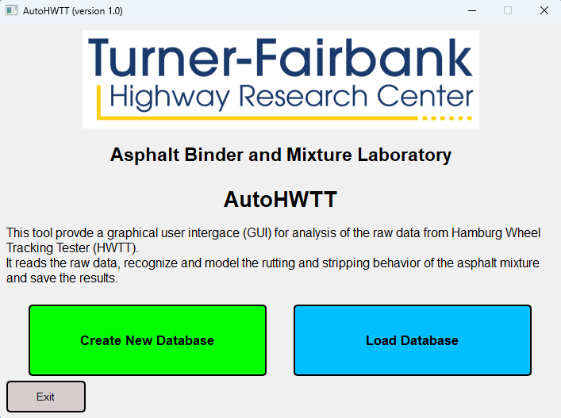
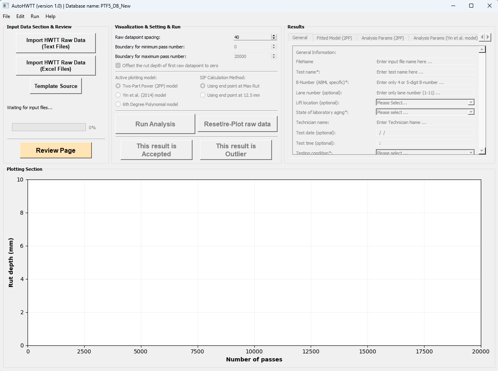
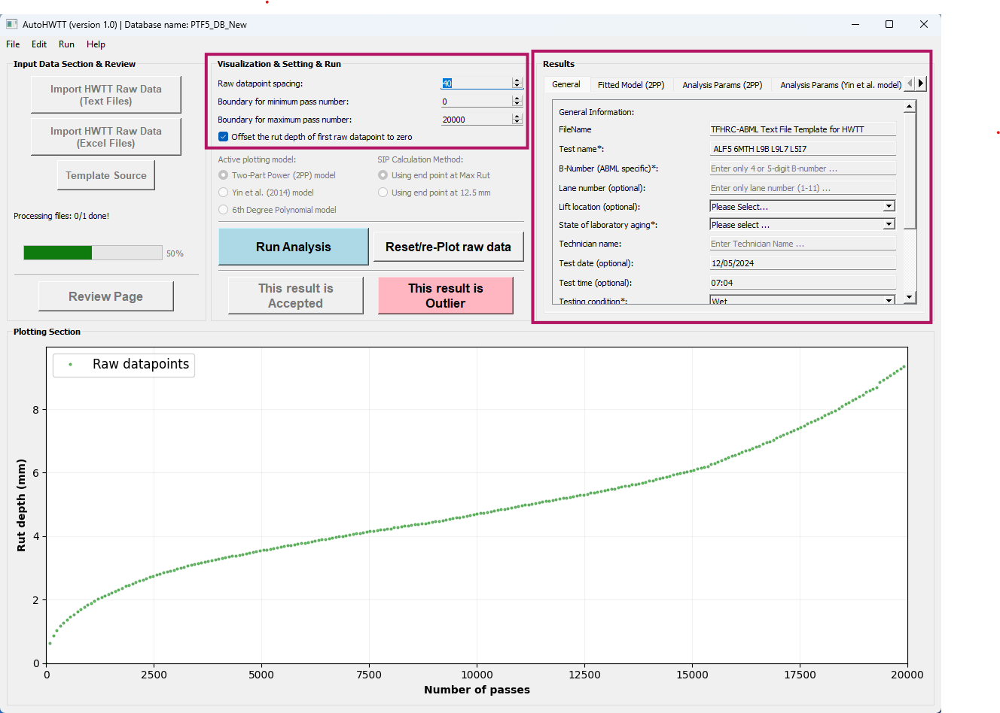
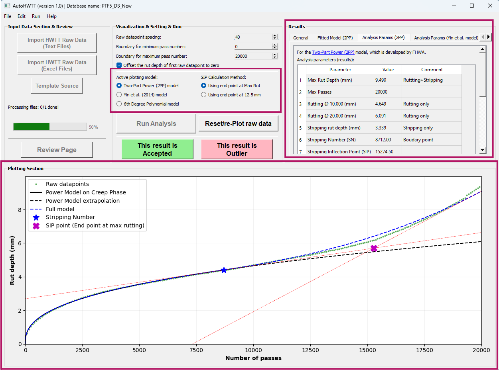
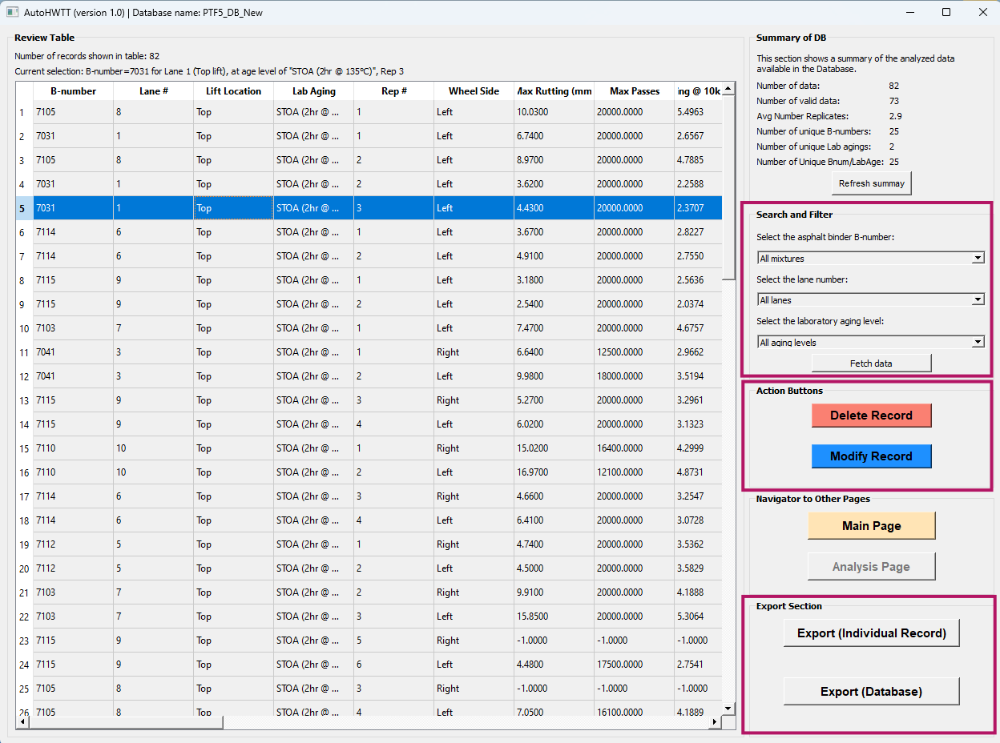

# AutoHWTT
**AutoHWTT** is a Python-based Graphical User Interface (GUI) designed specifically to analyze Hamburg Wheel Tracking Test (HWTT) results and manage related data for asphalt laboratories.

[](https://github.com/TFHRC-ABML/AutoHWTT/blob/main/LICENSE)  
**[Paper (coming soon)](XXXX)**

## Authors and Contributors:
- *S. Farhad Abdollahi (farhad.abdollahi.ctr@dot.gov)*
- *Behnam Jahangiri (behnam.jahangiri.ctr@dot.gov)*
- *Aaron Leavitt (aaron.leavitt@dot.gov)*
- *David Mensching (david.mensching@dot.gov)*

This repository hosts the official implementation of **AutoHWTT**.

**AutoHWTT** is a user-friendly GUI developed in Python to assist pavement engineers in analyzing Hamburg Wheel Tracking Test (HWTT) data for asphalt mixtures. The tool offers the following key features:

- **Data Preparation**: Import raw HWTT data (recorded passes and their corresponding rut depths) for visualization and allow users to specify the valid portion of the data for analysis.
- **Data Analysis**: Perform three distinct analysis methods:
  1. Two-Part Power (2PP) model (proposed by TFHRC ABML),
  2. Yin et al. (2014) model,
  3. 6th-degree polynomial model.  
  Additionally, compute relevant performance metrics such as Corrected Rut Depth (CRD), Stripping Number (SN), and Stripping Inflection Point (SIP), among others.
- **Database Management**: Store raw data and analysis results in an SQLite3 database, organized by mixture types, replicates, and aging levels.

---

## Table of Contents
1. [Setup Instructions](#setup-instructions)
2. [Sample Dataset](#sample-dataset)
3. [How to Use](#how-to-use)
4. [Acknowledgement](#acknowledgement)
5. [Citation](#citation)

---

## Setup Instructions
### Requirements:
To run this project, [Conda](https://docs.conda.io/en/latest/miniconda.html) (Miniconda or Anaconda) needs to be installed on your computer.

---

### Step-by-Step Instructions

#### Step 1: Install Conda
Ensure that Conda is installed on your system. You can download Miniconda or Anaconda from their official websites:
- [Miniconda](https://docs.conda.io/en/latest/miniconda.html)
- [Anaconda](https://www.anaconda.com/)

---

#### Step 2: Clone the Repository
Clone this repository to your local machine:
```bash
git clone https://github.com/TFHRC-ABML/AutoHWTT.git
cd AutoHWTT
```

---

#### Step 3: Set Up Python Environment
1. Verify that the `environment.yml` file is located in the `./configs/` directory.
2. Create a new Conda environment using the provided YAML file:
   ```bash
   conda env create --file ./configs/environment.yml
   ```
3. Activate the environment:
   ```bash
   conda activate auto
   ```

---

#### Step 4: Run the Program
Execute the program by running the following command:
```bash
python Main_GUI.py
```

---

#### Step 5 (Optional): Create an Executable Shortcut (Windows Only)
If desired, create an executable `.bat` file for easier access to AutoHWTT:
1. Right-click on your desktop and select `New > Text Document`. Rename it to `AutoHWTT.bat` (ensure the file extension is `.bat` and not `.txt`).
2. Open the file with a text editor and add the following:
   ```bash
   echo "PLEASE WAIT..."
   @echo off
   REM Change the directory
   cd "<YOUR_AutoHWTT_Directory>"
   REM Activate the Python environment
   CALL conda.bat activate auto
   REM Launch the program
   start "" pythonw Main_GUI.py
   ```
3. Replace `<YOUR_AutoHWTT_Directory>` with the full path to the directory containing your `Main_GUI.py` file.
4. Save and close the text editor. Double-click on `AutoHWTT.bat` to start the AutoHWTT program.

---

## Sample Dataset
An example database containing 82 HWTT test results for 10 different asphalt mixtures is provided at `./example/PTF5_DB_New.db`. Key details:
- Each mixture is identified by a unique four-digit **ID number** and **lane number**.
- The database tracks laboratory aging states, repetition numbers, and outliers (via the "IsOutlier" column).

**Note**: AutoHWTT was initially developed for the Asphalt Binder and Mixture Laboratory (ABML) at FHWA's Turner-Fairbank Highway Research Center (TFHRC). Users working outside TFHRC can use custom IDs and hypothetical lane numbers to store results.

The HWTT data can be provided as either text or Excel files. Example templates for both formats are available at `./example/`.

---


## How to Use
After running the code, the user will first be prompted to review and accept the "Terms of Use and Agreement." Upon accepting, the user will be directed to the welcome page (see [Figure 1](#fig-welcome)). Here, the user can either create a new database or load an existing one. An example database, `./example/PTF5_DB_New.db`, is provided in the package.

<a id="fig-welcome"></a>
<p align="center">
  
</p>
<p align="center"><b>Figure 1:</b> Welcome Page</p>

The main page (see [Figure 2](#fig-main-nodata)) will appear after loading the database. Users can use the "Import HWTT Raw Data" buttons to select additional `*.txt` or `*.xlsx` files containing HWTT results for analysis and storage in the database.

<a id="fig-main-nodata"></a>
<p align="center">
  
</p>
<p align="center"><b>Figure 2:</b> Main Page (No Data Loaded)</p>

After importing one or more HWTT data files, the data will be displayed on the main page as shown in [Figure 3](#fig-main-data). Users can then utilize the "Visualization & Setting & Run" panel to specify the valid boundaries for the minimum and maximum pass numbers, define the spacing for visualizing raw data points, and determine whether the first data point is offset to zero or not. 

Next, under the "General" tab, the user must provide the B-number, lane number, aging state, and testing conditions for each sample. These fields are required to save the results in the database. At any point, users can click the "Reset/re-Plot raw data" button to reset the current step, change the data boundary, or adjust visualization settings.

**Note**: If the HWTT data is too noisy or is deemed outlier for any reason, users can mark it as outlier by selecting the "This result is Outlier" button. The flagged results will be saved in the database with an outlier designation.

<a id="fig-main-data"></a>
<p align="center">
  
</p>
<p align="center"><b>Figure 3:</b> Main Page (Data Loaded)</p>

In the next step, users can click the "Run Analysis" button to perform data analysis using one of three available methods:
1. The **Two-Part Power (2PP)** model proposed by the ABML lab at FHWA's TFHRC,
2. The **Yin et al. (2014)** model, or
3. The **6th-degree polynomial model**.  

[Figure 4](#fig-analysis) provides a snapshot of the program with analysis results displayed. Since the optimization algorithms fit the selected models to the raw data, the analysis may take several seconds to complete. Once complete, the analysis results will be displayed under the "Results" section across multiple tabs, allowing users to explore them in detail. Additionally, the analysis results are overlaid onto the raw data plot, giving users the ability to visually compare different models or Stripping Inflection Point (SIP) calculation methods by toggling between radio buttons. 

**Note**: If a particular HWTT result includes unusual stripping behavior or non-standard trends, the models might not fit well to the data. In such cases, users can adjust the valid raw data points, click the "Reset/re-Plot raw data" button, and rerun the analysis. If the issue persists, users are advised to either manually analyze the results using the source code or mark the result as an outlier.

<a id="fig-analysis"></a>
<p align="center">
  
</p>
<p align="center"><b>Figure 4:</b> Main Page (Analysis Results)</p>

By clicking the "Review Page" button, users can access and manage all test results stored in the database (see [Figure 5](#fig-review)). This page includes filtering options, enabling users to filter records based on unique ID numbers and aging states. Individual rows of data can be selected by clicking on any cell in a row, allowing users to delete specific records permanently by using the "Delete Record" button.

<a id="fig-review"></a>
<p align="center">
  
</p>
<p align="center"><b>Figure 5:</b> Review Page</p>

Finally, the program offers two export options:
1. The entire database can be exported to an Excel file by clicking the "Export (Database)" button. The program will prompt users for a file name and directory location.
2. Individual records can be exported by selecting a row in the review table and clicking the "Export (Individual Record)" button. Users will be prompted for a file name and directory location, and the program will save the raw data and associated analysis results—including model coefficients and fitted trends—into an Excel file.

---

## Acknowledgement
We sincerely thank Scott Parobeck and Frank Davis for their support in preparing asphalt mixture samples and conducting HWTT testing.

---

## Citation
If you use AutoHWTT in your work, please use the following citation:

```bibtex
@conference{AbdollahiAutoHWTTPARC2025,
  title = {AutoHWTT: A Framework to Evaluate Rutting Performance of Asphalt Mixtures, Case Study: TFHRC PTF},
  author = {Abdollahi, Seyed Farhad and Jahangiri, Behnam and Leavitt, Aaron and Mensching, David},
  booktitle = {Peterson Asphalt Research Conference (PARC)},
  year = {2025},
  month = {July},
  location = {Laramie, WY},
  type = {Poster Presentation},
  langid = {english},
  keywords = {HWTT, asphalt mixture, Two-Part Power model, pavement testing facility, recycling agents, AutoHWTT, stripping, corrected rut depth},
  doi = {},
  urldate = {2025-07-17}
}
```

For questions or comments, please contact **Farhad Abdollahi** (farhad.abdollahi.ctr@dot.gov).
